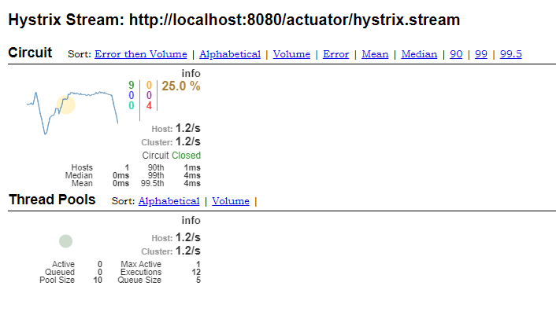
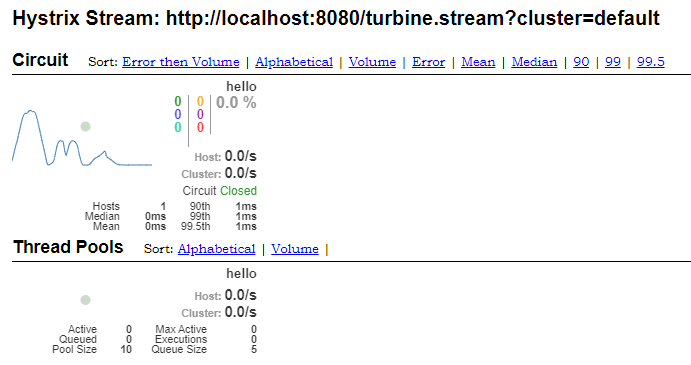

# Hystrix Dashboard Sample

## Hystrix for Hystrix Single

### 1. Enable Service in Application

We need enable Hystrix in Application in `HystrixDashboardApplication.java`. Add code block and add dependencies.

```java
// ...
@EnableHystrix
@EnableHystrixDashboard
// ...
```

### 2. Add Dependencies in `pom.xml`

Add dependencies `pom.xml`. We need dependencies: `actuator` and `hystrix*`.

```xml
<!-- ... -->
<!-- for Actuator -->
<dependency>
    <groupId>org.springframework.boot</groupId>
    <artifactId>spring-boot-starter-actuator</artifactId>
</dependency>

<!-- for Hystrix -->
<dependency>
    <groupId>org.springframework.cloud</groupId>
    <artifactId>spring-cloud-starter-hystrix</artifactId>
    <version>1.4.7.RELEASE</version>
</dependency>
<dependency>
    <groupId>org.springframework.cloud</groupId>
    <artifactId>spring-cloud-starter-hystrix-dashboard</artifactId>
    <version>1.4.7.RELEASE</version>
</dependency>
<!-- ... -->
```

### 3. Configuration in `application.properties`

After setup step 1 and 2, we need setting configuration to run Spring Cloud Netfix Hystrix. *Note: have solution to setting it but this project we need it is simplest to start*.

```properties
server.port=8080

spring.application.name=vtsspace-hystrix-dashboard

# Enable endpoints web. We need it when use Spring Boot 2.x.
# But with Spring 1.x is not need this setting.
management.endpoints.web.exposure.include=*

# Connect to Eureka. It is other service build independent with this project.
eureka.client.service-url.defaultZone=http://localhost:8761/eureka
```

Now we access to [http://localhost:8080/actuator/hystrix](http://localhost:8080/actuator/hystrix) set URL is [http://localhost:8080/actuator/hystrix.stream](http://localhost:8080/actuator/hystrix.stream). We will see below image.



## Turbine for Hystrix Matrix Stream

We continue with this project from *Hystrix for Hystrix for Single*. Only add more to apply Hystrix Matrix Stream wit `Turbine` of `Netflix`.

### 1. Enable Application

Enable Turbine and apply circuit breaker in application. We need enable circuit breaker that hystrix dashboard show circuit breaker list.

```java
// ...
@EnableCircuitBreaker
@EnableTurbine
// ...
```

### 2. Add Dependencies in `pom.xml`

To enable from (1) we need add dependencies in `pom.xml`.

```xml
<!-- ... -->
<dependency>
    <groupId>org.springframework.cloud</groupId>
    <artifactId>spring-cloud-starter-turbine</artifactId>
    <version>1.4.7.RELEASE</version>
</dependency>
<!-- ... -->
```

### 3. Configuration in `application.properties`

Setting config in `application.properties`. We need define application is name of application and set it to cluster `default`. So we can run Turbine Stream from [http://localhost:8080/turbine.stream?cluster=default](http://localhost:8080/turbine.stream?cluster=default).

```properties
turbine.app-config=vtsspace-hystrix-dashboard
turbine.clusterNameExpression= new String("default")
```

After call URL [http://localhost:8080/turbine.stream?cluster=default](http://localhost:8080/turbine.stream?cluster=default), we will see below image.




